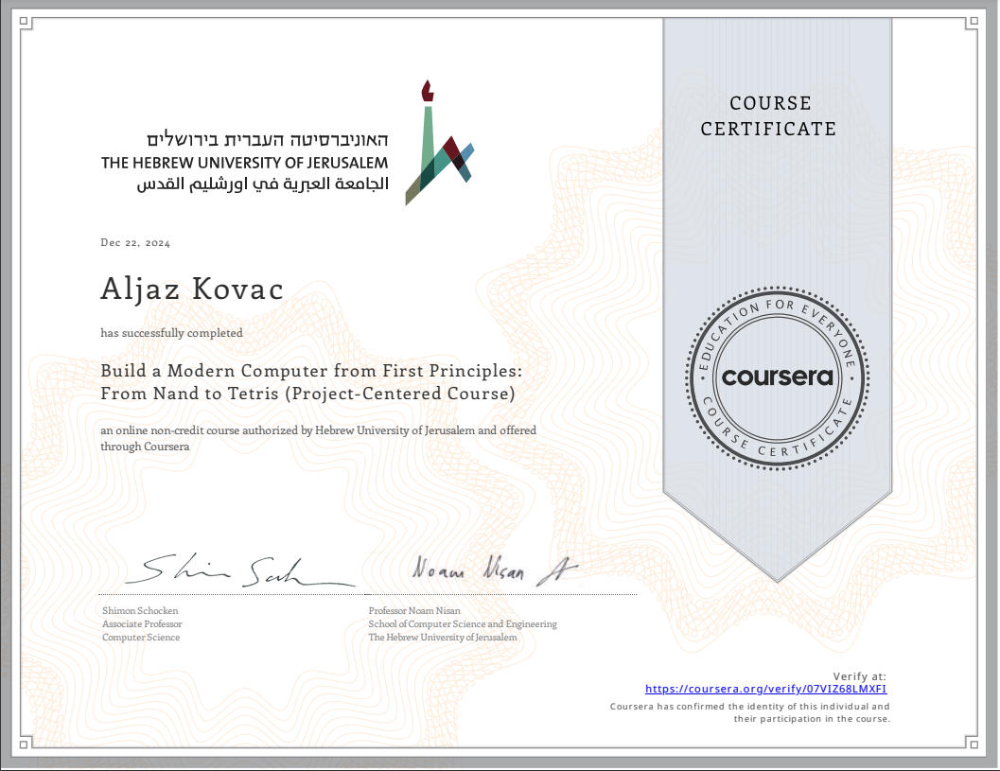

# [FromNand2Tetris](https://www.nand2tetris.org/)

In this famous course (often regarded as one of the best courses ever designed for Computer Science), we build a computer
from scratch, and then, using a higher-level programming language that we design ourselves, develop a program that runs on
that very computer.

This means that we go through all the building blocks a modern computer needs to be able to run software. In [Part I](https://www.coursera.org/learn/build-a-computer?) we design
the hardware, and in [Part II](https://www.coursera.org/learn/nand2tetris2) we focus on the software.

Part I consists of six projects:

1. Boolean functions and gate logic: design our own basic chips, using the course's HDL (Hardware Descriptive Language), e.g.
   And, Not, Or, Xor, Mux, Dmux, etc.
2. Boolean Arithmetic and the ALU (Arithmetic Logic Unit)
3. Build the main mermoy unit, RAM (random access memory)
4. Write assembly programs in the Hack assembly language
5. Build the CPU (central processing unit), and the entire computer architecture
6. Implement the assembler for the Hack assembly language

Welcome to read more in my [highlights and notes on the course](https://aljazkovac.github.io/posts/FromNand2Tetris/).

